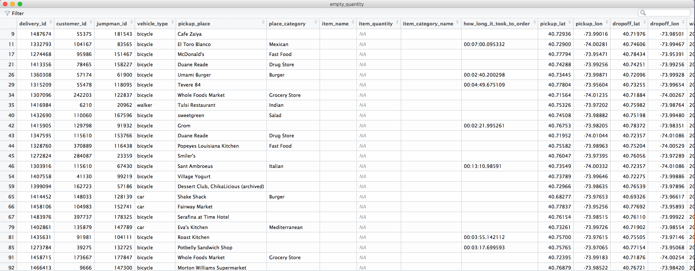
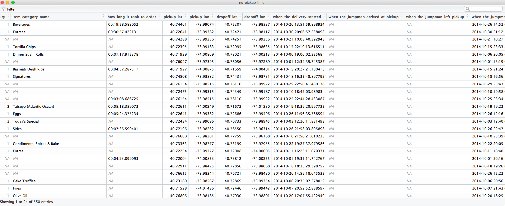
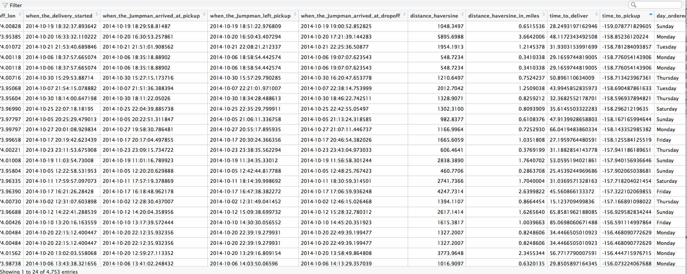

\ 
&nbsp;
\ 
&nbsp;


# Jumpman NYC Expansion

\ 
&nbsp;
\ 
&nbsp;

```{r setup, include=FALSE, echo=FALSE}
file_name <- "/Users/justinhilliard/Desktop/Jumpman23"
setwd(file_name)
jumpman_data <- data.frame(read.csv("analyze_me.csv", header=T, na.strings=c("","NA")))
library("geosphere")
library("dplyr")
library("ggplot2")
library("ggmap")
library("leaflet")
library("gridExtra")
library("tibble")
library("lubridate")
library("reshape2")
library("asbio")
jhilliard_theme <- theme(
  panel.background = element_rect(fill = "white"),
  axis.title.x = element_text(family = "sans", size = 12, color = "black"),
  axis.title.y = element_text(family = "sans", size = 12, color = "black"),
  plot.title = element_text(family = "sans", size = 16, color = "black"),
  legend.text = element_text(family = "sans", size = 8, color = "black"),
  legend.position = "right",
  legend.title = element_text(family = "sans", size = 10, color = "black"),
  axis.ticks = element_line(color = "black"),
  axis.text = element_text(family = "sans", size = 8, color = "black")
)
jumpman_data <- jumpman_data %>% rowwise() %>% mutate(distance_haversine = distHaversine(c(pickup_lon, pickup_lat), c(dropoff_lon, dropoff_lat)))
jumpman_data$distance_haversine_in_miles <- jumpman_data$distance_haversine / 1609
jumpman_data$time_to_deliver <- difftime(as.POSIXct(jumpman_data$when_the_Jumpman_arrived_at_dropoff, "%Y-%m-%d %H:%M:%S"), as.POSIXct(jumpman_data$when_the_delivery_started, "%Y-%m-%d %H:%M:%S"))
jumpman_data$time_to_pickup <- difftime(as.POSIXct(jumpman_data$when_the_Jumpman_arrived_at_pickup, "%Y-%m-%d %H:%M:%S"), as.POSIXct(jumpman_data$when_the_delivery_started, "%Y-%m-%d %H:%M:%S"))
jumpman_data$day_ordered <- weekdays(as.Date(jumpman_data$when_the_delivery_started))
jumpman_data$hour_ordered <- format(as.POSIXct(jumpman_data$when_the_delivery_started, format="%Y-%m-%d %H:%M:%S"), "%H")
jumpman_data$date_no_time <- format(as.POSIXct(jumpman_data$when_the_delivery_started, format="%Y-%m-%d %H:%M:%S"), "%Y-%m-%d")
jumpman_data$time_to_pickup_num <- as.numeric(jumpman_data$time_to_pickup)
jumpman_data$time_to_deliver_num <- as.numeric(jumpman_data$time_to_deliver)
```


#  Goal 1:  Data Integrety Issues  {.tabset}

\ 
&nbsp;

**PLEASE SEE ALL TABS :)**

\ 
&nbsp;

\ 
&nbsp;

## Summary: All Found Issues 

1. Item quantity, name and category is null

2. Jumpman arrive at pick up location time is before the start of delivery time.

3. Jumpman arrived and left pick-up time is null

4. Place Category is null

5. How Long It Took To Order is null

\ 
&nbsp;

## Issue 1: Item Quantity, Name, and Category is Null

```{r include=FALSE}
numbered_quantity <- jumpman_data[!is.na(jumpman_data$item_quantity),]
empty_quantity <- jumpman_data[is.na(jumpman_data$item_quantity),]
```

**Description of the issue**: It appears that within some of the delivery rows there is a "N/A" value for the item quantity, category and name.

**Percent of effected Records**: 20.5 %

**Why is this an issue**: Sending a jumpman to a pickup location without any desired items to deliver undermines the value Application

### Example:


### Root of the issue:

### Hypothesis for what might be causing this issue

1. **Cancellations**:  The mean delivery completion time and distance for rows with an empty order quantity field are significantly lower than rows with a filled item quantity field.  This might imply that the user rethought their purchase and obtained the item them-self.

```{r warning=FALSE, message=FALSE}
ggplot() + geom_density(data = numbered_quantity, aes(x=time_to_deliver,  fill= "Number"), adjust = 1, alpha=.3) + geom_density(data = empty_quantity, aes(x=time_to_deliver, fill="N/A"), adjust = 1, alpha=.3) + jhilliard_theme + scale_fill_manual(name="Item Quantity", values=c(Number="#56B4E9", "N/A"="#E69F00")) + labs(x="Minutes", y="Density", title="Time to Complete Delivery")+ xlim(0, 125)

ggplot() + geom_density(data = numbered_quantity, aes(x=distance_haversine_in_miles,  fill= "Number"), adjust = 1, alpha=.3) + geom_density(data = empty_quantity, aes(x=distance_haversine_in_miles, fill="N/A"), adjust = 1, alpha=.3) + jhilliard_theme + scale_fill_manual(name="Item Quantity", values=c(Number="#56B4E9", "N/A"="#E69F00")) + labs(x="Miles", y="Density", title="Delivery Distance")

one.sample.z(empty_quantity$time_to_deliver, mean(numbered_quantity$time_to_deliver), sigma = sd(numbered_quantity$time_to_deliver))

one.sample.z(empty_quantity$distance_haversine_in_miles, mean(numbered_quantity$distance_haversine_in_miles), sigma = sd(numbered_quantity$distance_haversine_in_miles))
```

### What is not causing the issue

1. The issue is not stemming from certain customers, jumpmen, pickup places, vehicle types or place categories as non of the values are unique to rows with empty item quantities.

```{r include=FALSE, warning=FALSE, message=FALSE}
# Since all these numbers are greater than 0, we can validate the statement above
nrow(numbered_quantity[which(numbered_quantity$pickup_place %in% unique(empty_quantity$place_category)), ])
nrow(numbered_quantity[which(numbered_quantity$jumpman_id %in% unique(empty_quantity$jumpman_id)), ])
nrow(numbered_quantity[which(numbered_quantity$customer_id %in% unique(empty_quantity$customer_id)), ])
nrow(numbered_quantity[which(numbered_quantity$pickup_place %in% unique(empty_quantity$pickup_place)), ])
nrow(numbered_quantity[which(numbered_quantity$vehicle_type %in% unique(empty_quantity$vehicle_type)), ])
nrow(numbered_quantity[which(numbered_quantity$place_category %in% unique(empty_quantity$place_category)), ])
```

2. There doesn't seem to be an issue with pickup and drop off locations as the locations for rows with empty item quantity fields and not empty quantity fields are spread throughout the city.

```{r  warning=FALSE, message=FALSE}
ny <- get_map(location = c(lon = -73.972026, lat = 40.745362), zoom = 12)
pickup_num  <- ggmap(ny, extent = "device", legend = "topleft") + geom_point( aes(x = pickup_lon, y = pickup_lat), size = .3, data = numbered_quantity) + labs(title= "Normal Pickup Locations")
pickup_empty <- ggmap(ny, extent = "device", legend = "topleft") + geom_point( aes(x = pickup_lon, y = pickup_lat), size = .3, data = empty_quantity)  + labs(title= "N/A Item Quantity Pickup Locations")
grid.arrange(pickup_num, pickup_empty, nrow=1, ncol=2)

pickup <- ggmap(ny, extent = "device", legend = "topleft") + geom_point( aes(x = dropoff_lon, y = dropoff_lat), size = .3, data = numbered_quantity) + labs(title= "Normal Dropoff Locations")
dropoff <- ggmap(ny, extent = "device", legend = "topleft") + geom_point( aes(x = dropoff_lon, y = dropoff_lat), size = .3, data = empty_quantity)  + labs(title= "N/A Item Quantity Dropoff Locations")
grid.arrange(pickup, dropoff, nrow=1, ncol=2)
```

\ 
&nbsp;

## Issue 2: Arrived and left pick-up time is null

```{r include=FALSE}
pickup_time <- jumpman_data[!is.na(jumpman_data$when_the_Jumpman_arrived_at_pickup),]
no_pickup_time <- jumpman_data[is.na(jumpman_data$when_the_Jumpman_arrived_at_pickup),]
```

**Description of the issue**: It appears that within some of the delivery rows there is a "N/A" value for the time the jumpman arrived at the pickup destination

**Percent of effected Records**: 9.2 %

**Why is this an issue**: Not knowing the amount of time spent at a pick up location can create  unpredictability in wait time at pick up locations.  It becomes difficult to calculate which pick locations are the most profitable.

### Example:



### Root of the issue:

### Hypothesis for what might be causing this issue

1. **Jumpman forgets to notify app upon pickup location arrival**:  It is possible that jumpmen forget to update the application when they arrive at the pickup location.  The app should notify jumpmen when their phone's GPS comes within a reasonable radius of the pickup location.  Also, we could send them a reminder to check-in after the median time (10 minutes) for jumpman to arrive at a pickup location. It is interesting to note that their is a significant difference in the time and distance of these specific orders.  This is interesting because deliveries with pickup location take a shorter time to deliver, but are also a greater distance away from the customer.

```{r warning=FALSE, message=FALSE}
median(pickup_time$distance_haversine_in_miles)
median(no_pickup_time$distance_haversine_in_miles)
median(pickup_time$time_to_deliver)
median(no_pickup_time$time_to_deliver)

one.sample.z(no_pickup_time$time_to_deliver, mean(pickup_time$time_to_deliver), sigma = sd(pickup_time$time_to_deliver))

one.sample.z(no_pickup_time$distance_haversine_in_miles, mean(pickup_time$distance_haversine_in_miles), sigma = sd(pickup_time$distance_haversine_in_miles))
```

### What is not causing the issue

1. **Location of Pickup Place**: Originally, I suspected a lack of cell service as the reason the jumpmen did not check in, but there is no noticeable difference between two cohort's pick up place location.

```{r  warning=FALSE, message=FALSE}
# Since all these numbers are greater than 0, we can validate the statement above
ny <- get_map(location = c(lon = -73.972026, lat = 40.745362), zoom = 13)
pickup <- ggmap(ny, extent = "device", legend = "topleft") + stat_density2d( aes(x = pickup_lon, y = pickup_lat, alpha = ..level..), size = 2, bins = 4, data = no_pickup_time, geom = "polygon") + labs(title= "Density of Pickup Location \n with No Pickup Checkin Time")
dropoff <- ggmap(ny, extent = "device", legend = "topleft") + stat_density2d( aes(x = dropoff_lon, y = dropoff_lat, alpha = ..level..), size = 2, bins = 4, data = pickup_time, geom = "polygon")  + labs(title= "Density of Pickup Location \n with Pickup Checkin Time")
grid.arrange(pickup, dropoff, nrow=1, ncol=2)
```

\ 
&nbsp;

## Issue 3: Jumpmen Arrive at Pickup Location Time before Delivery Start Time

See: Other issues not broken down

### Example:



\ 
&nbsp;

## Other Issues Not Broken Down

As this is an pre-interview assignment, I am not going to go in-depth on the other 3 issues that I found with the data.

1. **BIG ONE: JUMPMAN ARRIVE AT THE PICK UP LOCATION BEFORE THE DELIVERY IS STARTED**

2. Place Category is null

3. How Long It Took To Order is null


\ 
&nbsp;

## Non Issues

  1. **ID integrety**: While there are duplicate delivery ids, this does not denote ID integrity issues.  It denotes that a customer ordered multiple items from the same location in a single order.  It is also worth noting, these duplicate delivery ids all correspond to a single customer id, jumpman id and start time.


\ 
&nbsp;

#  Goal 2:  State of the Union (How are things going in NY?) {.tabset}

\ 
&nbsp;

**PLEASE SEE ALL TABS :)**


\ 
&nbsp;


\ 
&nbsp;

# High Level Summary

While deliveries per day and unique customers ordering per day is growing, new customer acquisition is declining.  This would suggest customers are being retained and ordering more than once.


\ 
&nbsp;

\ 
&nbsp;

```{r include=FALSE, warning=FALSE, message=FALSE}
jumpman_data_cleaned <- jumpman_data[which(!is.na(jumpman_data$item_quantity) & jumpman_data$time_to_pickup_num > 0),]
```


For this analysis as to not have the "dirty" rows affect the findings, I have cleaned out rows from the Data set with pick up times that are before order times and rows with empty item quantity values.

## Delivery Breakdown

```{r include=FALSE, warning=FALSE, message=FALSE}
order_by_day <-  jumpman_data_cleaned %>%
                    group_by(date_no_time, delivery_id) %>% 
                    summarize(count = n())

order_by_day_no_dup_delivery_id <-  order_by_day %>%
                    group_by(date_no_time) %>% 
                    summarize(count = n())

ny <- get_map(location = c(lon = -73.972026, lat = 40.745362), zoom = 13)

jumpman_day_hour <- jumpman_data_cleaned %>%
                    group_by(day_ordered, hour_ordered) %>% 
                    summarize(count = n())

dow_format <- c("Sunday","Monday","Tuesday","Wednesday","Thursday","Friday","Saturday")

jumpman_day_hour$day_ordered <- factor(jumpman_day_hour$day_ordered, level = rev(dow_format))

pickup_location <- jumpman_data_cleaned[ which(!is.na(jumpman_data_cleaned$time_to_pickup)), ]
```

### Delivery Count Growth

```{r  warning=FALSE, message=FALSE}
ggplot(order_by_day_no_dup_delivery_id, aes(x = as.Date(date_no_time), y = count)) + geom_point() + geom_smooth(colour="darkgoldenrod1", size=1.5, method="loess", se=FALSE) + geom_smooth(method="lm", se=FALSE) + labs(x="Date", y="Number of Deliveries", title="Number of Deliveries per Day")+ jhilliard_theme
```

The growth of delivers is modest, but growing since the open of the NYC market.  There are peaks that correspond with Sundays.

### Delivery Dropoff and Pickup Location

```{r  warning=FALSE, message=FALSE}
pickup <- ggmap(ny, extent = "device", legend = "topleft") + stat_density2d( aes(x = pickup_lon, y = pickup_lat, alpha = ..level..), size = 2, bins = 4, data = jumpman_data_cleaned, geom = "polygon") + labs(title= "Density of Pickup location")
dropoff <- ggmap(ny, extent = "device", legend = "topleft") + stat_density2d( aes(x = dropoff_lon, y = dropoff_lat, alpha = ..level..), size = 2, bins = 4, data = jumpman_data_cleaned, geom = "polygon")  + labs(title= "Density of Dropoff Locations")
grid.arrange(pickup, dropoff, nrow=1, ncol=2)
```

Delivery pick up location concentration is higher than drop off location concentration.  Customers tend to order from places in East Village and lower Manhattan, but orders get delivered to a much broader area.  This makes sense, as East Village has a large concentration of shops and restaurants.  One interesting thing of note is drop off location density in the upper east side, this _MAY_ imply that the customer market segment tends to have higher incomes.

### Deliveries By Time and Day

```{r  warning=FALSE, message=FALSE}
ggplot(na.omit(jumpman_day_hour), aes(x = hour_ordered, y = day_ordered, fill=count)) +
    geom_tile() +
    theme(axis.text.x = element_text(angle = 90, vjust = 0.6, size = 10)) +
    labs(x = "Hour of Request", y = "Day of Week of Request", title = "# of Delivery Requests in NYC, by Day and Time of Request") +
    scale_fill_gradient(low = "white", high = "#2980B9")
```

Orders tend to be concentrated around dinner time for all days of the week.  Delivery times very more on weekends, but still seems to be concentrated around dinner.  Weekends have more orders than weekdays. 

### Distance from Pickup to Dropoff Location

```{r  warning=FALSE, message=FALSE}
ggplot(data=jumpman_data_cleaned) + geom_histogram(aes(x=distance_haversine_in_miles), fill="springgreen4", binwidth = .15) + labs(x="Miles", y="Delivery Count", title="Distance from Pickup to Dropoff Location") + scale_fill_manual(name="Item Quantity", values=c("mean_line"="orange", "median_line"="purple")) + jhilliard_theme + geom_vline(aes(xintercept = mean(distance_haversine_in_miles), colour = "mean_line")) + geom_vline(aes(xintercept = median(distance_haversine_in_miles), colour = "median_line"))
```

There is a uni-modal distribution for pick up to drop off locations. Pick up to drop off location distance tend to be under 2 miles with a median of ~1 mile.  Since some deliveries are further than 4 miles, it would be worth investigating delivery methods of those deliveries.

### Time to Complete Delivery 

```{r  warning=FALSE, message=FALSE}
ggplot(data=jumpman_data_cleaned) + geom_histogram(aes(x=time_to_deliver), fill="springgreen4", binwidth = 5) + labs(x="Minutes", y="Delivery Count", title="Time to Complete the Delivery") + scale_fill_manual(name="Item Quantity", values=c("mean_line"="darkblue", "median_line"="purple")) + jhilliard_theme + geom_vline(aes(xintercept = mean(time_to_deliver_num), colour = "mean_line")) + geom_vline(aes(xintercept = median(time_to_deliver_num), colour = "median_line"))
```

The distribution of delivery completion time is uni-modal with a median of ~45 minutes.  There are some deliveries that took over an hour, it would be worth investigating those to see why they took longer than an hour.


### Time to Pickup Item for Delivery 

```{r warning=FALSE, message=FALSE}
ggplot(data=pickup_location) + geom_histogram(aes(x=time_to_pickup/60), binwidth = 5, fill="springgreen4") + labs(x="Minutes", y="Delivery Count", title="Time to Reach Pickup Location") + scale_fill_manual(name="Item Quantity", values=c("mean_line"="darkblue", "median_line"="purple")) + jhilliard_theme + geom_vline(aes(xintercept = mean(time_to_pickup_num)/60, colour = "mean_line")) + geom_vline(aes(xintercept = median(time_to_pickup_num)/60, colour = "median_line"))
```

The distribution of pickup location arrival time is uni-modal with a median of ~20 minutes. The negative values in this column have been cleaned for this graph.

\ 
&nbsp;

## Customer Breakdown

```{r include=FALSE}
start <-  jumpman_data_cleaned %>%
                    group_by(date_no_time, customer_id)

customer_by_day <- start %>% 
                    group_by(date_no_time) %>% 
                    summarize(count = n())

customer_order_number <-  start %>%
                    group_by(customer_id) %>% 
                    summarize(count = n())

customer_first_order_day <-  start %>%
                    group_by(customer_id) %>% 
                    summarize(earliest_order_date = min(date_no_time))

customer_first_order_day <- customer_first_order_day %>%
                    group_by(earliest_order_date) %>% 
                    summarize(count = n())

# I would have this peer reviewed to make sure this is the best way to look at retention

#NOTE: This takes a long time to run so I wrote it to a CSV

# daily_retention <- expand.grid(date1 = unique(as.Date(jumpman_data_cleaned$date_no_time), "%Y-%m-%d"), date2 = unique(as.Date(jumpman_data_cleaned$date_no_time), "%Y-%m-%d")) %>%
#   filter(date1 < date2) %>%
#   group_by(date1, date2) %>%
#   do({ids_1 = setdiff(unique(jumpman_data_cleaned[jumpman_data_cleaned$date_no_time == ymd(.$date1),]$customer_id),
#                       unique(jumpman_data_cleaned[jumpman_data_cleaned$date_no_time < ymd(.$date1),]$customer_id))
#   N_ids_1 = length(ids_1)
#   ids_2 = unique(jumpman_data_cleaned[jumpman_data_cleaned$date_no_time == ymd(.$date2),]$customer_id)
#   N_ids_2 = length(intersect(ids_2, ids_1))
#   data.frame(Prc = N_ids_2/N_ids_1)}) %>%
#   ungroup()
# 
# daily_retention$date_diff <- difftime(daily_retention$date2, daily_retention$date1)

daily_retention <- read.csv(file = "daily_retention_df.csv", header = TRUE)
```

### Unique Customers Ordering per Day

```{r warning=FALSE, message=FALSE}
ggplot(customer_by_day, aes(x = as.Date(date_no_time), y = count)) + geom_point() + geom_smooth(colour="darkgoldenrod1", size=1.5, method="loess", se=FALSE) + geom_smooth(method="lm", se=FALSE) + labs(x="Date", y="Number of Customers", title="Number of Unique Customers who Ordered in a given Day") + jhilliard_theme
```


### New Customers per Day
The growth of **_unique_ customers orders per day** is growing, but at a modest rate.  There are peaks that correspond with Sundays.  **BUT...**

```{r warning=FALSE, message=FALSE}
ggplot(customer_first_order_day, aes(x = as.Date(earliest_order_date), y = count)) + geom_point() + geom_smooth(colour="darkgoldenrod1", size=1.5, method="loess", se=FALSE) + geom_smooth(method="lm", se=FALSE) + labs(x="Date", y="Number of New Customers", title="First Time Customers Who Ordered per Day") +jhilliard_theme
```

It is important to note, new customer acquisition has gone down since the launch of the NYC market.  This means that new customer orders has gone down.  We can be solve this by a customer acquisition campaign.

### Customer Order Retention

```{r warning=FALSE, message=FALSE}
ggplot(data = daily_retention) + geom_line(aes(y=Prc, x=date_diff, group=date1), colour="grey") + geom_smooth(aes(y=Prc, x=date_diff), colour="darkgoldenrod1", size=1.5, se=FALSE) + labs(y="Percent Retained", x="Days Since Order", title="Likelihood of an Order N Days after a Seperate Order \n from a Unique Customer") + jhilliard_theme
```

The expected likelihood of another order coming in n days after an order is ~3%.  This means, if you buy 100 ordering customers through an acquisition campaign, it would not be unreasonable to expect, this set of customers would generate ~3 returning customers per day (for the foreseeable future) after initially acquired. While this doesn't tell the whole customer retention story, it is a nice start.  

I ignore the increasing trend at the end of the graph because it is likely caused by the early adopter bias.

# Fun Bonus Map: Top 10 Percentile of Pickup Locations

Top 10 Percentile of Pickup Locations as determined by number of items ordered.

```{r warning=FALSE, message=FALSE}
map <- leaflet()
map <- addTiles(map)
order_place <- aggregate(cbind(count = item_quantity) ~ pickup_place + pickup_lat + pickup_lon, 
          data = jumpman_data_cleaned, 
          FUN = function(x){ NROW(x) })
order_place <- data.frame(order_place)
order_place <- order_place %>% rowwise() %>% mutate(popup = paste(pickup_place, toString(count), sep=" : ") )
order_place <- order_place[ which(order_place$count >= 21), ]
map <- addMarkers(map, lng=order_place$pickup_lon, lat=order_place$pickup_lat, popup=order_place$popup)
map
```

This map shows the top 10% of places people placed that an ordered an item.  The user can click on the marker to get the name of the restaurant and the number of items ordered from that location.